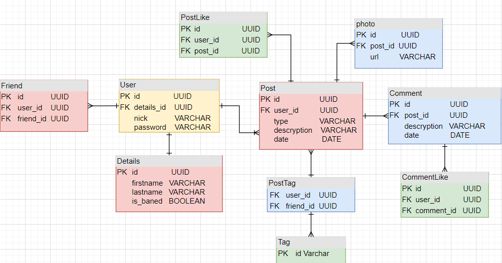

# social-media-system
REStFul API including full information about the posts and users. The service was implemented using a hexagonal architecture.
## Database structure

## Technologies
* Spring Boot
* Gradle
* JUnit4
* Mockito
* JPA
* Postgres
* Security
* Docker
* Docker-compose
* Vavr
## Endpoints
*
## How to run
